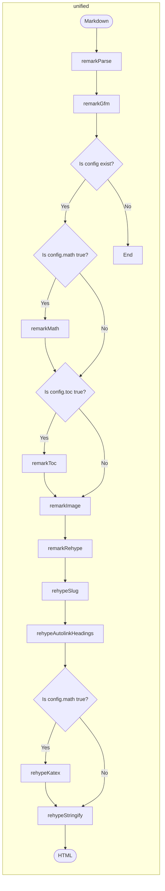

# Next.js Static Blog

사용 기술 스택

- Framework : Next.jS
- Style : [Stitches](https://stitches.dev/)
- Markdown Parser: unified, [remark](https://github.com/remarkjs/remark)
- Search Engine : [Lunr.js](https://lunrjs.com/)

## Markdown parsing pipeline

## NextJS Static HTML Export

[**Documents**](https://nextjs.org/docs/advanced-features/static-html-export)

### Supported Features

The majority of core Next.js features needed to build a static site are supported, including:

- [Dynamic Routes when using getStaticPaths](https://nextjs.org/docs/routing/dynamic-routes)
- Prefetching with next/link
- Preloading JavaScript
- [Dynamic Imports](https://nextjs.org/docs/advanced-features/dynamic-import)
- Any styling options (e.g. CSS Modules, styled-jsx)
- [Client-side data fetching](https://nextjs.org/docs/basic-features/data-fetching/client-side)
- [getStaticProps](https://nextjs.org/docs/basic-features/data-fetching/get-static-props)
- [getStaticPaths](https://nextjs.org/docs/basic-features/data-fetching/get-static-paths)
- [Image Optimization](https://nextjs.org/docs/basic-features/image-optimization) using a [custom loader](https://nextjs.org/docs/basic-features/image-optimization#loader)

### Unsupported Features

Features that require a Node.js server, or dynamic logic that cannot be computed during the build process, are not supported:

- [Image Optimization (default loader)](https://nextjs.org/docs/basic-features/image-optimization)
- [Internationalized Routing](https://nextjs.org/docs/advanced-features/i18n-routing)
- [API Routes](https://nextjs.org/docs/api-routes/introduction)
- [Rewrites](https://nextjs.org/docs/api-reference/next.config.js/rewrites)
- [Redirects](https://nextjs.org/docs/api-reference/next.config.js/redirects)
- [Headers](https://nextjs.org/docs/api-reference/next.config.js/headers)
- [Middleware](https://nextjs.org/docs/middleware)
- [Incremental Static Regeneration](https://nextjs.org/docs/basic-features/data-fetching/incremental-static-regeneration)
- [fallback: true](https://nextjs.org/docs/api-reference/data-fetching/get-static-paths#fallback-true)
- [getServerSideProps](https://nextjs.org/docs/basic-features/data-fetching/get-server-side-props)

## Licences

- [Radix Icons - designed by the @modulz team](https://icons.modulz.app/)
